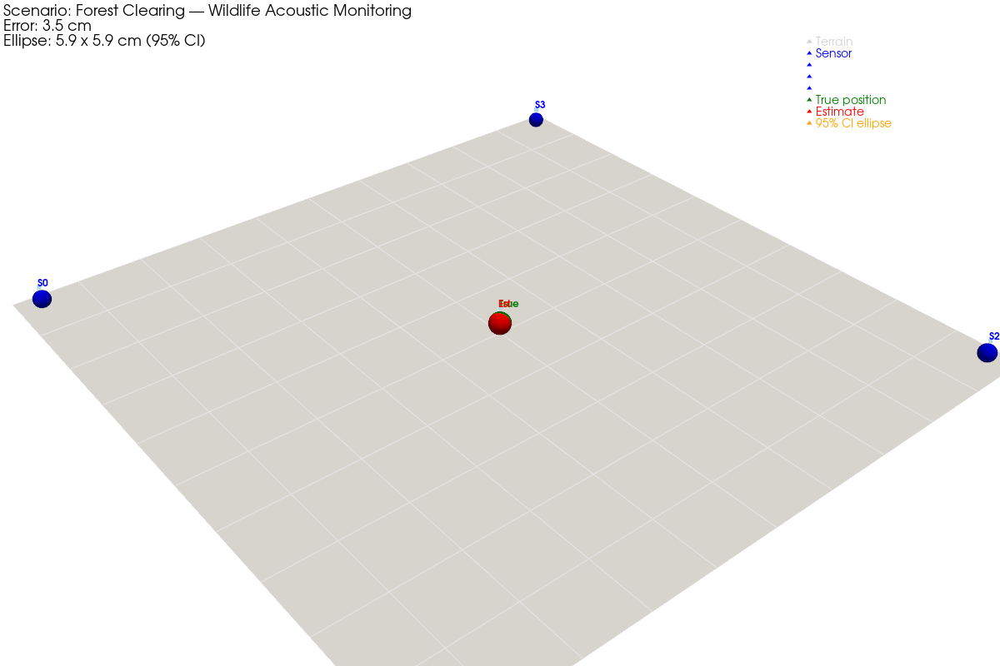

# Acoustic Source Localization Digital Twin

Real-time 3D digital twin of acoustic source localization in outdoor environments.
A network of fixed microphone sensors estimates the 2D position of a moving sound
source using Time Difference of Arrival (TDOA) — with quantified localization
uncertainty shown as a live 95% confidence ellipse.

**Applications:** wildlife monitoring, environmental noise mapping, urban acoustic
awareness, emergency response routing, impulsive event localization.

**Author:** Umar Farooq  
**Phase:** 1 complete — Python + PyVista + Rich

---

## Demo



Two windows run simultaneously from a single command:

**3D render (PyVista)** — terrain, sensor array, moving source (green), estimated
position (yellow), and live 95% confidence ellipse updating every tick.

**Terminal panel (Rich)** — localization metrics, error sparkline, per-sensor SNR
table.

```powershell
python scripts/run_demo.py
```

---

## Algorithm

The core algorithm is a **weighted Gauss-Newton TDOA solver** with a
**CRLB-based confidence ellipse**:

1. Each sensor records the Time of Arrival (TOA) of the acoustic wavefront.
2. TDOA is computed relative to sensor 0 — this introduces correlated noise
   (all measurements share sensor-0's noise).
3. The correct noise covariance `C = σ²(I + 11ᵀ)` is inverted via
   Sherman-Morrison: `M⁻¹ = I − (1/N)·11ᵀ`.
4. Gauss-Newton iterates on the nonlinear hyperbolic system using weighted MLE:
   `Δp = (JᵀM⁻¹J)⁻¹ Jᵀ M⁻¹ (−residuals)`
5. Position covariance is the Fisher Information Matrix inverse:
   `Σ = σ_r² · (JᵀM⁻¹J)⁻¹`
6. The 95% confidence ellipse uses the chi-squared threshold `χ²(0.95, 2) = 5.991`.

**Validated:** 22/22 unit tests pass. Monte Carlo confirms empirical 95% CI coverage.
Mean localization error: **2.6 cm** at 0.1 ms timing noise on a 300 m sensor array.

---

## Architecture

```
scenarios/configs/*.yaml
        |
        v
  scenarios/loader.py    (Pydantic v2 — validated on load)
        |
        v
   engine/               (pure algorithm — never imports viz or dashboard)
   ├── source.py         (waypoint path follower)
   ├── propagation.py    (PropagationModel Protocol + SimplePropagation)
   ├── tdoa.py           (TDOA measurements + Gaussian noise)
   ├── localizer.py      (GaussNewtonTDOA — weighted MLE)
   ├── confidence.py     (95% CI ellipse via CRLB)
   └── engine.py         (tick loop orchestrator)
        |
        v
  shared/current_state.json   (atomic JSON IPC — written each tick)
        |
   ┌────┴────┐
   v         v
visualization/  dashboard/
live_renderer   panel.py
(PyVista 3D)   (Rich terminal)
```

---

## Quick Start

```powershell
# Create virtual environment
python -m venv .venv
.venv\Scripts\activate

# Install dependencies
pip install -e ".[dev]"

# Algorithm smoke test (no window)
python scripts/run_tdoa_demo.py

# Full demo — 3D window + terminal panel
python scripts/run_demo.py

# Tests
python -m pytest tests/ -v
```

---

## Scenarios

Scenarios are fully defined in YAML — swap the file, get a different deployment.

| Scenario | Description |
|---|---|
| `wildlife_monitoring.yaml` | 4 sensors, 300 m forest clearing, animal at 1.2 m/s |

---

## Project Docs

| Document | Purpose |
|---|---|
| [Functional Report](docs/functional-report.md) | Algorithm derivation, validation results, deployment questions |
| [Decision Log](docs/decision-log.md) | All architectural and algorithmic decisions with rationale |
| [Concepts Notebook](docs/concepts.ipynb) | Estimation theory: TDOA geometry, CRLB, GDOP |
| [Project Status](docs/project-status.md) | Step-by-step progress log |

---

## Phase 2 (planned)

Port visualization layer to Unreal Engine 5. Engine and algorithm layer unchanged.

---

## License

MIT
